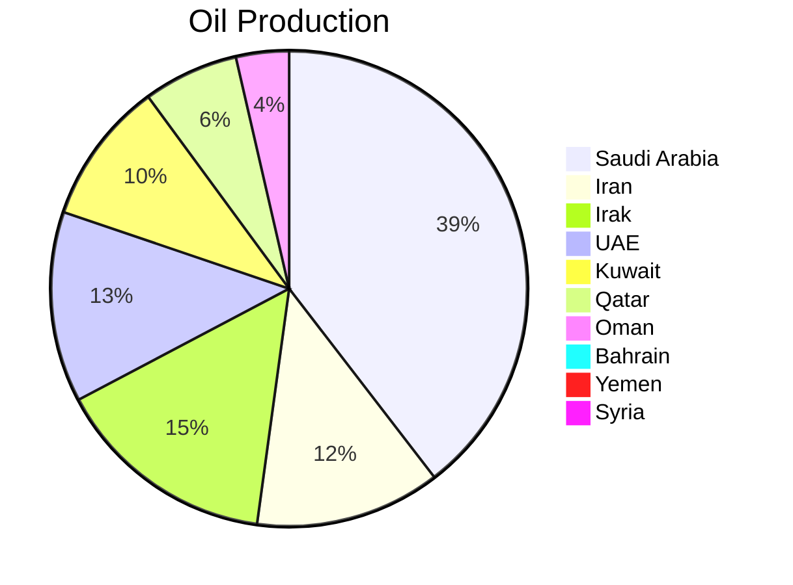
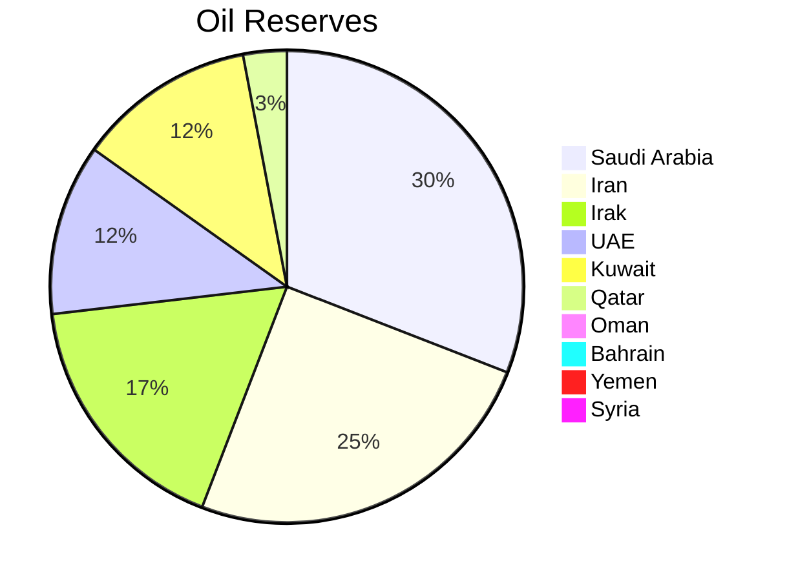

## [[M - Oil Producing Countries in the Middle East]]

| Country                  | Oil Production (bbl/day) | Reserves (UA EIA) | Years in Reserve |
| ------------------------ | ------------------------ | ----------------- | ---------------- |
| [[Saudi Arabia]]         | 11.3 million             | 259,000           | 65.4             |
| [[Iran]]                 | 3.5 million              | 209,000           | 163              |
| [[Iraq]]                 | 4.2 million              | 145,000           | 94.8             |
| [[United Arab Emirates]] | 3.6 million              | 98,000            | 74               |
| [[Kuwait]]               | 2.7 million              | 102,000           | 103              |
| [[Qatar]]                | 1.8 million              | 25,000            | 38               |
| [[Oman]]                 | 1.0 million              | 5,400             | 15               |
| [[Bahrain]]              | 189,000                  | 200               | 3                |
| [[Yemen]]                | 59,000                   | 4,400             | 100              |
| [[Syria]]                | 42,000                   | 2,500             | 160              |

## See also
- [[Map of Oil Producing Countries in the Middle East]]
- [List of countries by proven oil reserves - Wikipedia](https://en.wikipedia.org/wiki/List_of_countries_by_proven_oil_reserves#cite_note-eia2021production-8)
